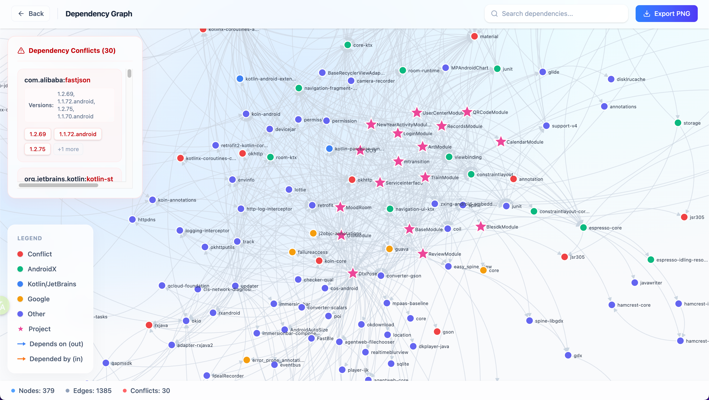
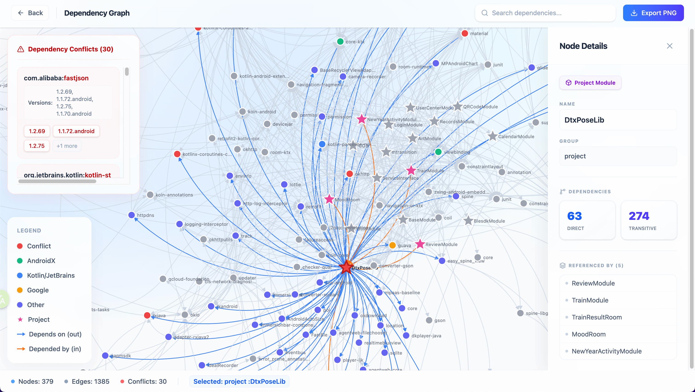

# Gradle Dependency Visualizer

[English](README.md) | [中文](README.cn.md)

一个面向 Android 项目的 Gradle 依赖关系可视化工具。  
它将 `./gradlew dependencies` 的输出解析为交互式关系图，帮助你快速定位依赖层级、冲突版本和关键节点。

在线演示：<https://deps.aimfor.top>

## 核心特性

- 解析 Gradle 依赖树文本并生成图结构
- 以交互式力导向图展示依赖关系
- 自动检测并标记依赖版本冲突
- 支持节点搜索与详情查看
- 支持导出当前图谱为 PNG 图片

## 技术栈

- React 19
- TypeScript
- Vite
- D3.js
- Framer Motion

## 本地开发

- 安装依赖：`npm ci`
- 启动开发环境：`npm run dev`
- 构建生产产物：`npm run build`
- 代码检查：`npm run lint`

## 截图

## 部署

项目包含 GitHub Actions 工作流：在 `main` 分支推送后自动构建并部署到服务器（Nginx）。
